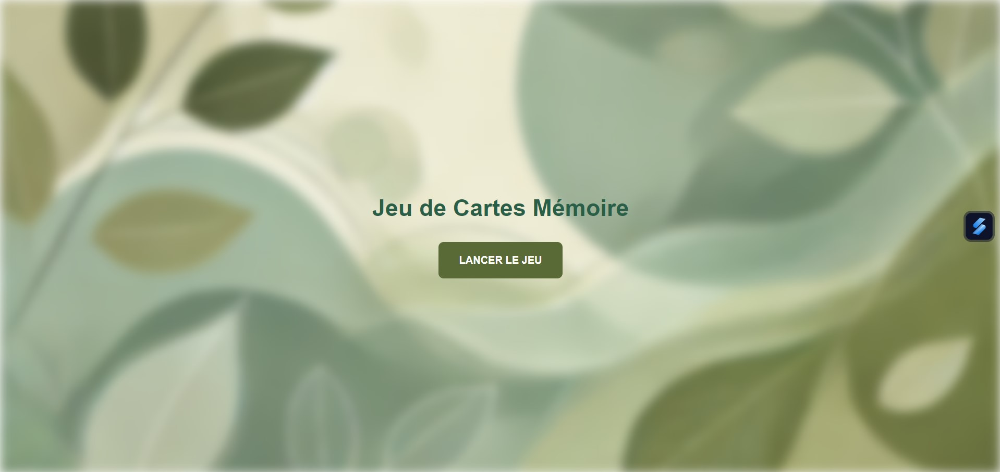
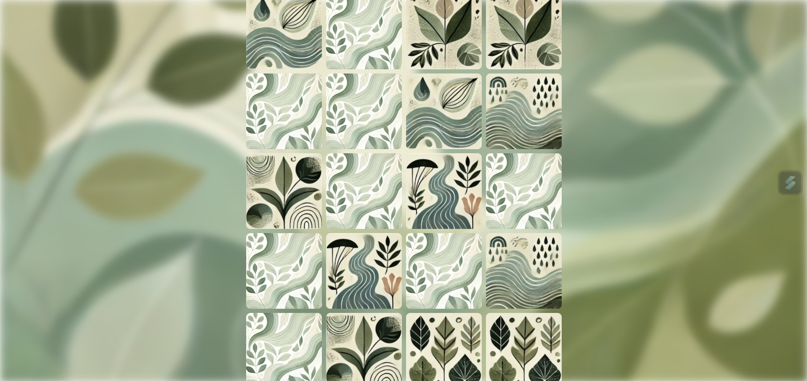
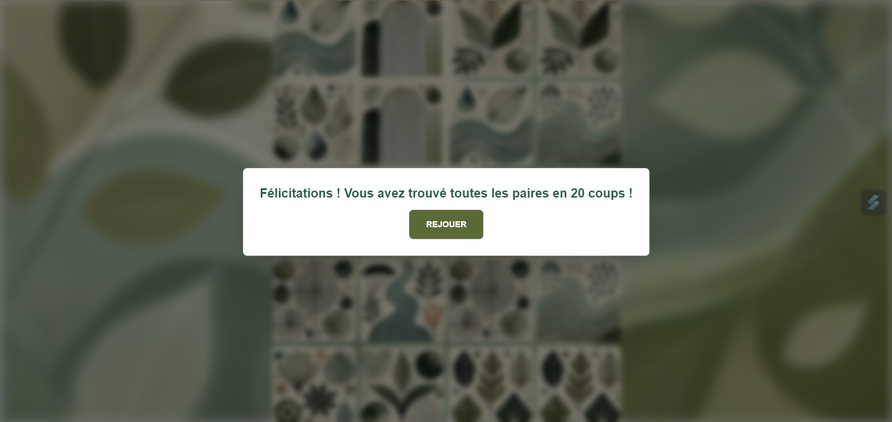
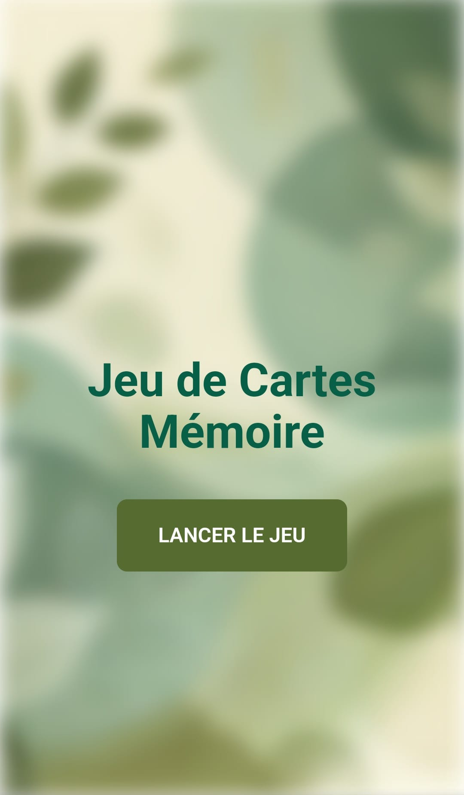
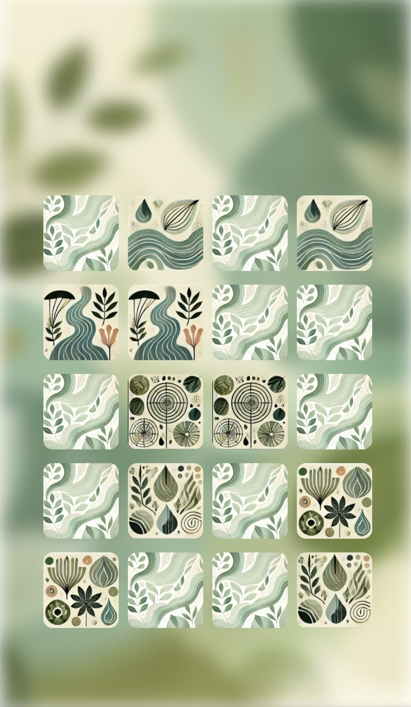
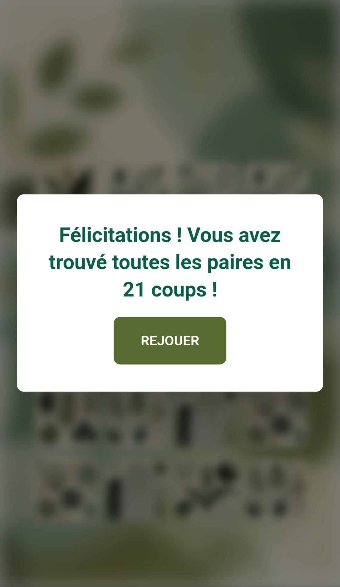

# 🃏 Jeu de Cartes Mémoire 🃏

 

Bienvenue dans ce projet de jeu de cartes mémoire en ligne, conçu pour tester votre mémoire de manière ludique et interactive. Défiez-vous à trouver toutes les paires de cartes en un minimum de coups tout en profitant d’une interface moderne et élégante ! 🎮   

 

## 📜 Présentation

Ce jeu de mémoire propose une interface intuitive avec une expérience utilisateur fluide. Vous devrez retrouver les paires de cartes identiques cachées parmi un plateau de 20 cartes (10 paires). Avec un design responsif et une attention particulière portée aux détails visuels, ce projet est idéal pour ceux qui souhaitent se divertir ou pour ceux qui cherchent un exemple de projet en HTML, CSS, Tailwind, et JavaScript.   

 
 

## ✨ Fonctionnalités Principales  

🎨 Interface fluide et moderne   
📱 Responsive Design : Le jeu s’adapte à toutes les tailles d’écrans, des ordinateurs aux smartphones   
🔄 Mélange aléatoire des cartes à chaque nouvelle partie   
🕒 Affichage temporaire des cartes pour mémorisation rapide au début de la partie   
✨ Effets visuels et animations élégantes pour une expérience utilisateur agréable   
🏆 Suivi des performances : Nombre de coups nécessaires pour compléter le jeu   
🎉 Pop-up de victoire stylisée avec la possibilité de rejouer   

## 📸 Aperçu

Voici à quoi ressemble l'application :   

   

   

   

   

   

   

 
 

[Démo vidéo du projet sur ordinateur 🎥](https://www.youtube.com/watch?v=8qbFRkFqBys)

[Démo vidéo du projet sur mobile 🎥](https://www.youtube.com/watch?v=NT8LOCx-OSs)

 
 

## 🌐 Lien direct

Pour l'utiliser : [Jeu de Cartes Mémoire 🃏](https://gabriellepagnard.github.io/Cartes-memoire/)   

 
 

## 🔧 Technologies Utilisées

⚙️ HTML5 : Structure du jeu
🎨 CSS3 & TailwindCSS : Styles, animations et design responsive
💻 JavaScript (ES6+) : Logique du jeu, interactions et dynamique des cartes

 
 

## 📂 Fichiers du Projet

- index.html : Structure principale de l'application   
- style.css : Styles personnalisés en complément de TailwindCSS   
- app.js : Logique du jeu   
- images/ : Dossier contenant les images des cartes et de l'arrière-plan    
- ressources/ : Dossier contenant le favicon, les screenshot, et autres ressources etc...   

 
 

## 🛠️ Installation et Utilisation

Pour démarrer avec Jeu de cartes mémoire, suivez ces étapes simples :   

➡️ Clonez le Répertoire :   

`git clone https://github.com/votre-utilisateur/jeu-de-cartes-memoire.git`   

➡️ Accédez au Répertoire :   

`cd jeu-de-cartes-memoire`   

➡️ Ouvrez le Fichier "index.html" dans votre navigateur pour voir l'application en action   

➡️ Personnalisez le Code selon vos besoins ou apportez des contributions !   

 
 

## 🏗️ Comment Contribuer

Vous souhaitez contribuer ? 🎉 Voici comment faire :   

### Créer une Branche 🌿

➡️ Pour chaque nouvelle fonctionnalité ou correction, créez une nouvelle branche :   

`git checkout -b nom-de-la-branche`   

### Faire vos Changements ✏️   

Apportez les modifications nécessaires et committez-les :   

`git add .`   
`git commit -m "Description des changements"`   

### Pousser les Changements ⬆️   

Envoyez vos modifications à GitHub 📨 :

`git push origin nom-de-la-branche`   

### Créer une Pull Request 🔄   

Allez sur GitHub, ouvrez une Pull Request et expliquez vos modifications   

 
 

## 🤝 Contributeurs/trices

Gabrielle Pagnard 🧑‍💻 - Créatrice du projet

 
 

## 📬 Contact

Pour toute question ou suggestion, n'hésitez pas à me contacter :   

Email : gpagnard@gmail.com   
GitHub : [GabriellePagnard](https://github.com/GabriellePagnard)     

 
 
 

Merci d'avoir pris le temps de découvrir ce projet ! 🌟   
J'espère que vous avez autant de plaisir à y jouer que j'en ai eu à le développer. Si ce projet vous a plu, n'hésitez pas à lui donner une petite étoile ⭐ sur GitHub – c’est la meilleure façon de montrer votre soutien et de m’encourager à continuer à améliorer ce jeu (et d'autres projets à venir) ! 🎉   

 

Chaque étoile, chaque retour compte énormément et m’aide à rester motivé pour créer encore plus de contenu de qualité. ✨   

 

Merci encore et amusez-vous bien ! 🎮🚀   